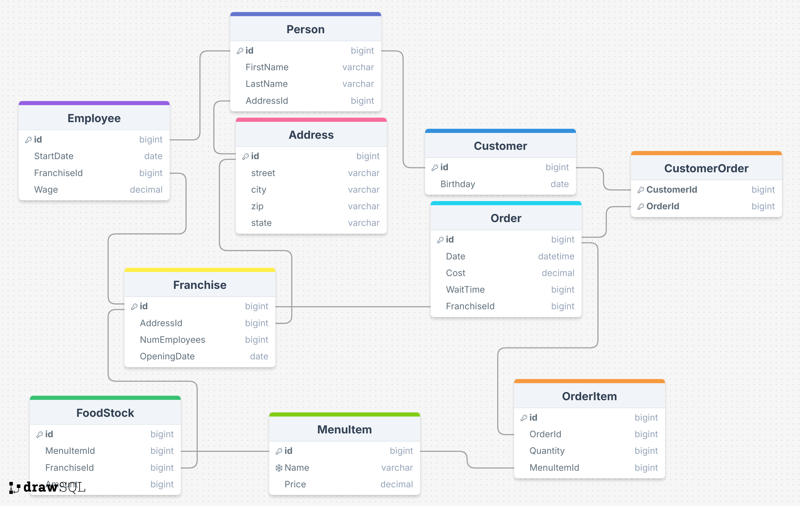
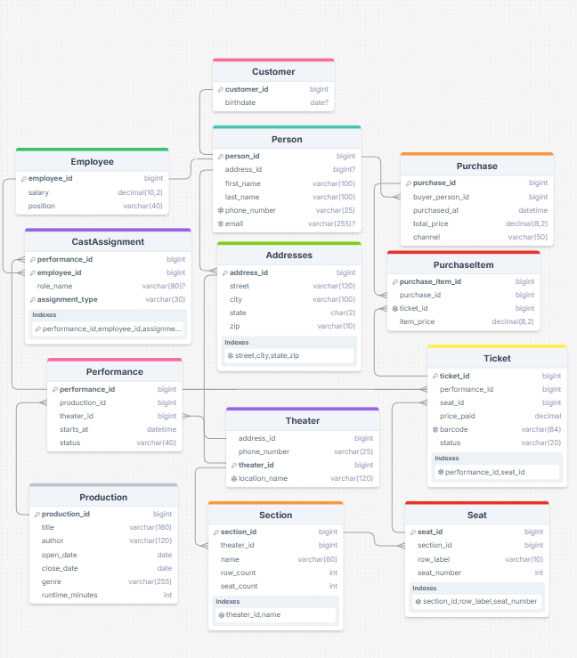

# McDonald Database

<!-- One+ sentence description or purpose of your database -->
Our database is designed to help McDonald's keep track of all the information related to their different Franchises, including information like employees, customers, food stock, and orders. Efficient storage of this information will be vital to the company's ability to assess each franchises' success and make changes where necessary.

<!-- Picture of Schema  -->
### McDonald Schema

### Cross Domain Theater Schema

<!-- Sample question, SQL query, response that worked (if you have one)  -->

## Query I thought it did well on

zeroshot meeting
"how many big macs does franchise 2 have in stock?"
"SELECT Amount \nFROM FoodStock \nJOIN MenuItem ON FoodStock.MenuItemId = MenuItem.Id \nWHERE MenuItem.Name = 'Big Mac' AND FoodStock.FranchiseId = 2;\n"
response: "[(110,)]" 

<!-- Sample question, SQL query, response that did not work (if you have one)  -->
## Question that it tripped up on

<!-- A file outlining at least 6 other examples.  -->
## File of Other Examples
1.
one_shot 
"how many employees work at the franchise with id = 1"
"\nSELECT COUNT(*) FROM Employee WHERE FranchiseId = 1;\n"
"[(3,)]"

2. 
zero_shot
"what menuItems were ordered in order 3?"
"\nSELECT MenuItem.Name \nFROM OrderItem \nJOIN MenuItem ON OrderItem.MenuItemId = MenuItem.Id \nWHERE OrderItem.OrderId = 3;\n"
"[('McChicken',), ('French Fries (Small)',), ('Soft Drink (Small)',)]"

3.

4.

5.

6.

<!-- Describe somewhere which prompting strategies you tried and if you noticed a difference between them. (Note my post only does two of three - which is fine!).  -->
## Conclusion
We tried a meeting strategy, meaning we told chat there was an urgent meeting, in order to see if the urgency did anything. We then did that with zero_shot and one_shot. Chat was able to get all of them correct, with no discernable differences.
While the answers were correct, there were queries that got to the same answer but different ways. For example, to get the number of employees one used the NumEmployee column and another used the EmployeeId foreign key.

We also made a strategy to try and confuse it by having it be completely unrelated to SQL: "who made this chicken??? Was it you?" as a pre-prompt with zero_shot, and it still got everything right.

